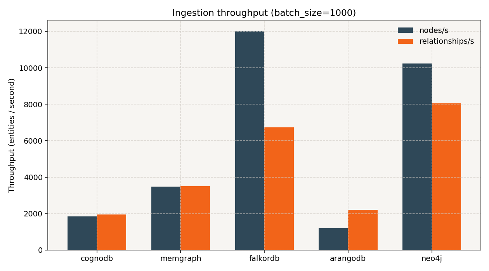
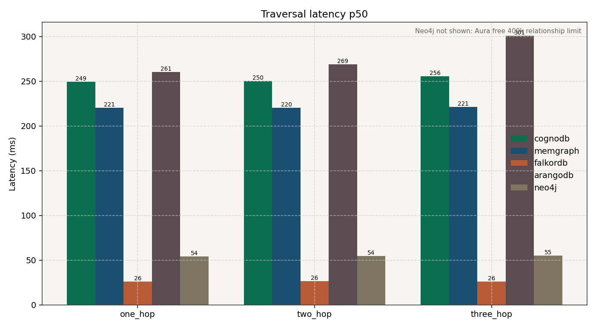
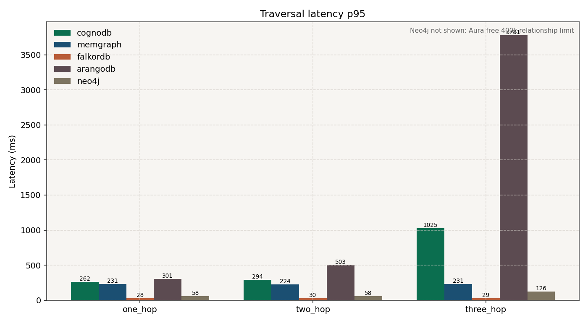
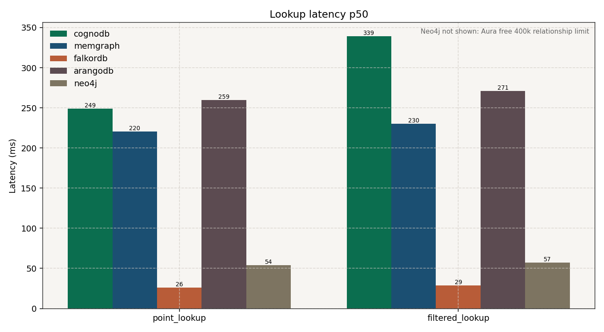
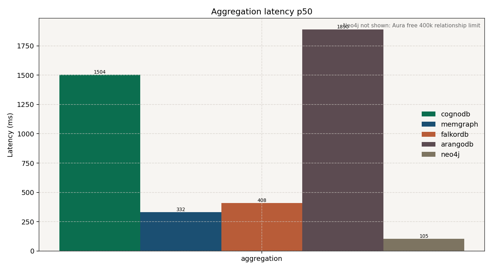
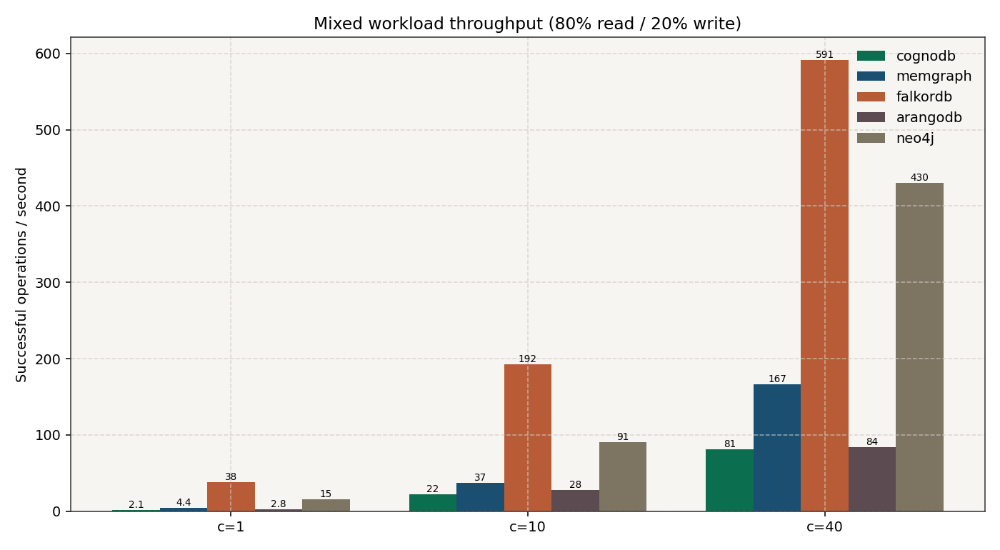
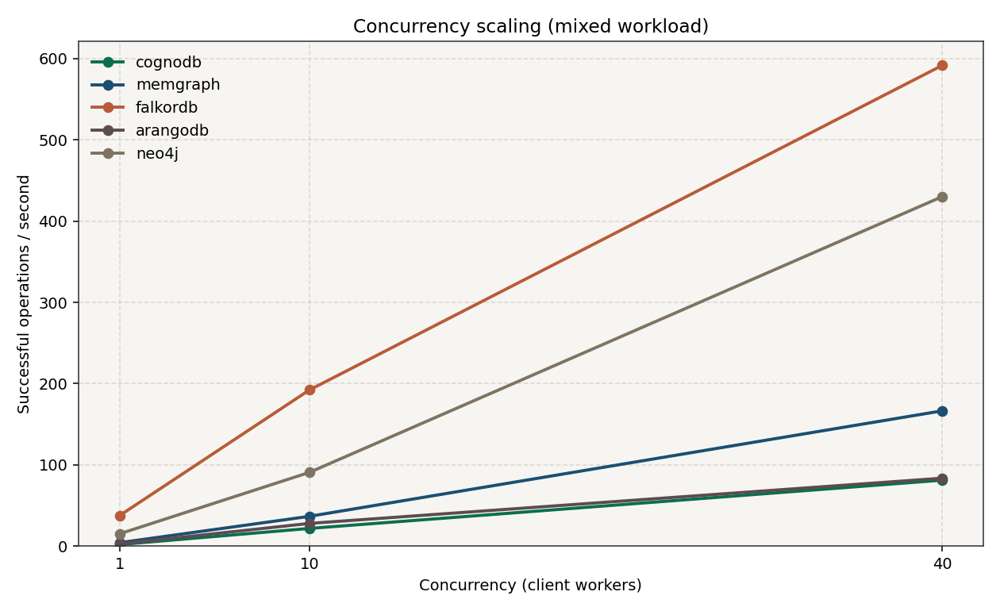

## 14. Charts

Generated from measured CSVs (not placeholders):

```powershell
python scripts/generate_report.py
```

| Chart | File |
|-------|------|
| Ingestion throughput |  |
| Traversal p50 |  |
| Traversal p95 |  |
| Lookup p50 |  |
| Aggregation p50 |  |
| Mixed QPS |  |
| Concurrency scaling |  |

---


# CognoDB Cloud Graph Database Benchmark

Honest, reproducible cloud benchmarking of **CognoDB Cloud** against Neo4j, Memgraph, FalkorDB, and ArangoDB using the same dataset, identical logical workloads, the same client machine, and documented resource configurations.

This repository is built incrementally. **Phase 1 (connectivity)** is implemented. Later phases add dataset preparation, ingestion, workloads, competitor adapters, and report generation.

The goal is **not** to make CognoDB win. The goal is a fair technical comparison.

---

## 1. Objective

Build a reproducible benchmarking suite that compares CognoDB Cloud with at least four other graph platforms under:

- the same public dataset
- the same logical workloads
- equivalent resource limits as closely as possible
- the same client machine
- consistent measurement methodology

Adapters keep logical operations identical even when query languages differ (Cypher vs AQL). Compatibility is not faked.

---

## 2. Databases Compared

| Database   | Role              | Query interface              | Phase status                          |
|------------|-------------------|------------------------------|----------------------------------------|
| CognoDB    | Primary           | Neo4j-compatible Bolt/Cypher | Phases 1–4 complete (loaded + measured) |
| Neo4j      | Comparison        | Cypher (Bolt)                | Phase 5 adapter ready                 |
| Memgraph   | Comparison        | Cypher-compatible            | Phase 5 adapter ready                 |
| FalkorDB   | Comparison        | Cypher via FalkorDB client   | Phase 5 adapter ready                 |
| ArangoDB   | Comparison        | AQL                          | Phase 5 adapter ready                 |

Databases without valid credentials are marked **NOT RUN / CREDENTIALS REQUIRED**. No fabricated numbers are published.

---

## 3. Dataset

Public SNAP dataset: **cit-HepPh** (Arxiv HEP-PH citation network).

| Field | Value |
|-------|--------|
| Source page | https://snap.stanford.edu/data/cit-HepPh.html |
| Download URL | https://snap.stanford.edu/data/cit-HepPh.txt.gz |
| Approximate published size | ~34,546 nodes / ~421,578 directed edges (SNAP) |
| Prepared shared benchmark graph | **34,489 nodes / 399,000 relationships** (Aura-safe subsample, seed 42) |
| Relationship type in prepared CSV | `CITES` |
| Node label | `Paper` |

Canonical outputs:

- `dataset/prepared/nodes.csv` — `node_id`, `label`
- `dataset/prepared/relationships.csv` — `source`, `target`, `relationship_type`
- `dataset/prepared/manifest.json` — exact counts, sizes, SHA-256, subsample metadata

Preparation is deterministic (comments skipped, self-loops removed, duplicate directed edges collapsed). Because Neo4j Aura free hard-caps at 400,000 relationships, the submission graph is a **deterministic seed-42 subsample to 399,000 edges** shared by **all five** databases (`python scripts/prepare_dataset.py --aura-safe --seed 42`). See `dataset/README.md`.

---

## 4. Benchmark Environment

| Item | Value |
|------|--------|
| Client OS | Document at run time |
| Client Python | 3.11+ |
| Primary DB | CognoDB Cloud c0 free instance |
| CognoDB region | N. Virginia / `us-east4` (per CognoDB UI) |
| CognoDB RAM | **512 MB** (UI-reported; see Resource Fairness) |
| CognoDB vCPU | burst to **0.5 vCPU** (UI-reported) |
| CognoDB storage | **1 GiB** |
| CognoDB connections | **200** |
| CognoDB disk IOPS | up to **500** |

Client machine details (CPU model, RAM, network) should be recorded when benchmarks are executed.

---

## 5. Resource Fairness

Equivalent resources across platforms are required by the assignment. **Resource parity is not claimed unless verified.**

### CognoDB (observed)

| Resource | Value | Source |
|----------|-------|--------|
| Deployment | Cloud free c0 | CognoDB UI |
| Region | us-east4 (N. Virginia) | CognoDB UI |
| vCPU | 0.5 burst | CognoDB UI |
| RAM | 512 MB | CognoDB UI |
| Storage | 1 GiB | CognoDB UI |
| Connections | 200 | CognoDB UI |
| Disk IOPS | up to 500 | CognoDB UI |

**RAM discrepancy:** the original assignment text mentioned **256 MB** free-tier RAM. The current CognoDB UI reports **512 MB**. This suite treats the **UI-reported value (512 MB)** as the actual test configuration and documents the discrepancy here.

### Competitors

See `docs/COMPETITOR_SETUP.md` and `docs/PHASE8_REVIEW.md`.

| Platform | Deployment | vCPU | RAM | Storage | Region | Notes |
|----------|------------|------|-----|---------|--------|-------|
| Neo4j | Aura free (observed) | not observable / unverified | not observable / unverified | not observable / unverified | not observable / unverified | Loaded shared 399k subsample (Aura 400k rel cap) |
| Memgraph | Cloud (observed) | not observable / unverified | not observable / unverified | not observable / unverified | not observable / unverified | Loaded shared subsample; TLS via `bolt+ssc` |
| FalkorDB | Cloud single (observed) | not observable / unverified | Browser ~few MB free tier (unverified exact) | not observable / unverified | ap-south-1 (Browser) | Loaded shared subsample on `benchmark` |
| ArangoDB | Cloud (observed) | not observable / unverified | not observable / unverified | not observable / unverified | not observable / unverified | AQL adapter; loaded shared subsample |

**Resource parity is not claimed** unless independently verified against CognoDB c0 (~0.5 burst vCPU / 512 MB / 1 GiB). Differences must be listed as caveats.

---

## 6. Methodology

Shared settings live in `config/benchmark.yaml`:

- `random_seed: 42`
- `warmup_iterations: 20`
- `measured_iterations: 100`
- `concurrency_levels: [1, 10, 40]`
- `read_ratio: 0.8` / `write_ratio: 0.2`
- configurable `batch_size`

Workloads are invoked via `GraphDatabaseAdapter` methods so the runner never embeds database-specific query syntax.

Timing uses high-resolution monotonic clocks (`time.perf_counter_ns()` for ingestion in Phase 3+).

Raw per-iteration latencies are retained; summaries and charts are derived from those files only.

---

## 7. Data Loading Benchmark

Phase 3 measures batched node and relationship ingestion for CognoDB (then other adapters):

- nodes/sec, relationships/sec
- node load time, relationship load time, total wall-clock ingestion time

Dataset download/preparation time is **excluded** from ingestion metrics.

---

## 8. Traversal Benchmark

Phase 4 implements directed outgoing 1-hop, 2-hop, and 3-hop traversals over `CITES`:

- one fixed start-node list (`dataset/prepared/start_nodes.json`, seed `42`) reused across platforms
- warm-up then ≥ 100 measured iterations
- each query returns a distinct neighbor **count** (logical traversal cost without shipping huge result lists)
- full latency distribution including **p50** and **p95** (also p90, p99, mean, std, min, max)

## 9. Lookup Benchmark

Phase 4 implements:

1. point lookup by `Paper.node_id` (unique constraint/index)
2. filtered lookup by `Paper.label = 'Paper'` (index on `label` when supported)

Index notes:

| Platform | Indexed property | Creation |
|----------|------------------|----------|
| CognoDB  | `Paper.node_id` unique + `Paper.label` index | Cypher `CREATE CONSTRAINT` / `CREATE INDEX IF NOT EXISTS` |
| Neo4j    | same as CognoDB | Neo4j 5 Cypher DDL |
| Memgraph | `node_id` unique + indexes on `node_id`/`label` | Memgraph `CREATE INDEX ON` / `CREATE CONSTRAINT ON` |
| FalkorDB | unique constraint on `node_id` + range index on `label` | FalkorDB client helpers |
| ArangoDB | persistent unique index on `node_id`, index on `label` | python-arango collection indexes |

Index behavior may not be directly comparable across engines; differences are recorded as caveats.

---

## 10. Aggregation Benchmark

Phase 4 implements at least one count/group-by style aggregation (e.g. relationships by type), with p50/p95 after warm-up.

---

## 11. Mixed Read/Write Benchmark

Phase 4 implements concurrent mixed workloads (default 80% reads / 20% writes) at concurrency levels 1, 10, and 40 where platform limits allow. Writes use temporary benchmark entities and clean up when possible.

---

## 12. Resource Footprint

Where observable: vCPU, RAM, storage allocation, stored DB size, client CPU/memory, connection limits, platform-reported info.

Unavailable metrics are reported as **not observable**. Values are never invented.

---

## 13. Results

Live measurements on the **identical** prepared graph for all five databases:
**34,489 nodes / 399,000 relationships** (deterministic cit-HepPh subsample, seed `42`, under Neo4j Aura free’s 400k rel cap).

Full tables: [`results/processed/report_tables.md`](results/processed/report_tables.md).  
Run status: [`results/PHASE6_STATUS.md`](results/PHASE6_STATUS.md).

Dataset checksums:

| Field | Value |
|-------|--------|
| Raw SHA-256 | `917e77b3344aed33fd2d849443c9512b7c528b9dc87251d4245fb3777bbe4128` |
| Prepared relationships SHA-256 | `0ca016b1b970f0249f121facde5c71b93d9fce45125fbe9122c9d85ab8e5b56d` |

### Run coverage

| Database | Load | Benchmark | Note |
|----------|------|-----------|------|
| cognodb | OK | OK | CognoDB c0 free (UI: 0.5 burst vCPU / 512 MB / us-east4) |
| neo4j | OK | OK | Neo4j Aura free (shared 399k subsample) |
| memgraph | OK | OK | Memgraph Cloud |
| falkordb | OK | OK | FalkorDB Cloud (`benchmark` graph; Browser region ap-south-1) |
| arangodb | OK | OK | ArangoDB Cloud (AQL adapters) |

### Ingestion

| Database | Nodes/s | Rels/s | Total load (ms) | Verified |
|----------|--------:|-------:|----------------:|----------|
| cognodb | 1833.8 | 1949.5 | 223554.5 | 34489 / 399000 |
| neo4j | 10238.0 | 8047.8 | 53042.8 | 34489 / 399000 |
| memgraph | 3483.0 | 3502.3 | 123881.3 | 34489 / 399000 |
| falkordb | 12009.4 | 6728.0 | 62212.7 | 34489 / 399000 |
| arangodb | 1198.5 | 2205.7 | 212674.3 | 34489 / 399000 |

### Traversal (p50 / p95 ms)

| Database | 1-hop p50 | 1-hop p95 | 2-hop p50 | 2-hop p95 | 3-hop p50 | 3-hop p95 |
|----------|----------:|----------:|----------:|----------:|----------:|----------:|
| cognodb | 249.5 | 261.8 | 250.2 | 293.5 | 255.7 | 1025.4 |
| neo4j | 54.0 | 58.3 | 54.4 | 58.1 | 55.2 | 125.9 |
| memgraph | 220.5 | 230.7 | 220.3 | 224.3 | 221.3 | 231.4 |
| falkordb | 26.1 | 28.5 | 26.3 | 29.7 | 26.0 | 28.6 |
| arangodb | 260.5 | 301.1 | 269.0 | 503.1 | 300.9 | 3781.4 |

### Lookup (p50 / p95 ms)

| Database | point p50 | point p95 | filtered p50 | filtered p95 |
|----------|----------:|----------:|-------------:|-------------:|
| cognodb | 249.2 | 275.7 | 339.3 | 413.1 |
| neo4j | 54.2 | 55.7 | 57.4 | 59.4 |
| memgraph | 220.3 | 224.5 | 230.3 | 233.0 |
| falkordb | 26.0 | 28.4 | 28.8 | 30.5 |
| arangodb | 259.5 | 304.5 | 271.2 | 392.0 |

### Aggregation (count by relationship type)

| Database | p50 (ms) | p95 (ms) | QPS |
|----------|---------:|---------:|----:|
| cognodb | 1504.0 | 2495.7 | 0.56 |
| neo4j | 105.4 | 126.0 | 8.73 |
| memgraph | 331.5 | 438.8 | 2.88 |
| falkordb | 408.0 | 462.6 | 2.37 |
| arangodb | 1890.1 | 2700.2 | 0.54 |

### Mixed workload throughput (ops/s)

| Database | c=1 | c=10 | c=40 |
|----------|----:|-----:|-----:|
| cognodb | 2.12 | 21.93 | 81.26 |
| neo4j | 15.33 | 90.88 | 429.99 |
| memgraph | 4.41 | 36.83 | 166.56 |
| falkordb | 37.77 | 192.26 | 591.39 |
| arangodb | 2.85 | 28.11 | 83.73 |

Resource parity is **not** claimed. Observed gaps may reflect region, tier memory, and network RTT as much as engine internals.

---

## 14. Charts

Generated from measured CSVs (not placeholders):

```powershell
python scripts/generate_report.py
```

| Chart | File |
|-------|------|
| Ingestion throughput |  |
| Traversal p50 |  |
| Traversal p95 |  |
| Lookup p50 |  |
| Aggregation p50 |  |
| Mixed QPS |  |
| Concurrency scaling |  |

---

## 15. Analysis

Observations from the measured runs (with fairness caveats):

1. **All five databases** loaded and verified the identical prepared graph (**34,489 / 399,000**) — a deterministic seed-42 subsample of cit-HepPh chosen so Neo4j Aura free’s 400k relationship cap does not force a split dataset.
2. **Point/traversal latencies** for CognoDB and Memgraph remained in a similar ~220–250 ms p50 band from this client; Neo4j was lower (~54 ms p50); FalkorDB measured ~26 ms p50; ArangoDB was higher and showed a heavy 3-hop p95 (~3.8 s).
3. **Aggregation** was relatively expensive on all platforms; Neo4j and Memgraph posted the lowest aggregation p50 among completed runs in this client observation window.
4. **Mixed concurrency scaled up** on all platforms from 1→10→40 workers; absolute QPS levels differ sharply (again, not normalized for hardware/region).
5. These are **honest end-to-end client-observed** numbers. They should not be read as a claim that any engine is universally “fastest,” especially while resources/regions are unequal.

---

## 16. Limitations and Caveats

- Competing platforms may not match CognoDB c0 resources (0.5 burst vCPU / 512 MB / 1 GiB / us-east4). Exact competitor vCPU/RAM/storage/region are mostly **not observable / unverified** in vendor consoles from this setup.
- FalkorDB Browser showed an **ap-south-1** endpoint; CognoDB was **us-east4** — client RTT differs.
- The shared graph is a **399k-edge subsample** (seed 42), not the full 421,534 unique-edge cit-HepPh set, required for Neo4j Aura free participation under one dataset.
- Index semantics and query planners differ (Cypher vs AQL).
- Cloud free tiers may throttle; none of the successful query iterations in this re-run recorded errors.
- CognoDB free-tier RAM documentation vs UI discrepancy (256 MB assignment text vs 512 MB UI).
- Charts use a zero baseline; large FalkorDB vs others gaps can compress visual detail for slower engines.

---
## 17. Reproduction Instructions

### Prerequisites

- Python 3.11+
- CognoDB Cloud account and a running c0 instance
- Later: accounts/instances for Neo4j, Memgraph, FalkorDB, ArangoDB

### Setup

```powershell
cd cognodb-graph-benchmark
python -m venv .venv
.\.venv\Scripts\Activate.ps1
python -m pip install --upgrade pip
pip install -r requirements.txt
copy .env.example .env
```

Edit `.env` with your CognoDB credentials (see Security). **Do not paste passwords into chat or commit `.env`.**

### Phase 1 — connectivity test

```powershell
python scripts/test_cognodb_connection.py
```

Expected success line:

```text
SUCCESS: Connected to CognoDB and executed RETURN 1 AS result.
```

### Phase 2 — prepare public dataset

```powershell
# Shared Aura-safe graph for all five platforms (required for Neo4j Aura free):
python scripts/prepare_dataset.py --aura-safe --seed 42
```

### Phase 3 — load into CognoDB

```powershell
# --clear is required when the database already contains data (destructive).
python scripts/load_data.py --database cognodb --clear
```

### Phase 4 — CognoDB workloads

```powershell
python scripts/run_benchmark.py --database cognodb
```

Optional subsets:

```powershell
python scripts/run_benchmark.py --database cognodb --workloads traversal,lookup
python scripts/run_benchmark.py --database cognodb --skip-mixed
```

### Phase 5 — competitor connectivity

```powershell
python scripts/test_connections.py
python scripts/load_data.py --database neo4j --clear
python scripts/run_benchmark.py --database neo4j
# or every DB with credentials configured:
python scripts/load_data.py --database all --clear
python scripts/run_benchmark.py --database all
```

Setup details: `docs/COMPETITOR_SETUP.md`

### Phase 7 — charts and tables

```powershell
python scripts/generate_report.py
python scripts/capture_environment.py
```

### Optional master pipeline (non-destructive unless `--clear`)

```powershell
# prepare + report only (no DB wipe)
python scripts/run_pipeline.py

# full reload + benchmark for ready DBs (explicit destructive clear)
python scripts/run_pipeline.py --load --clear --benchmark --database all
```

Databases are never cleared unless `--clear` is provided with `--load`.

### Unit tests (no cloud credentials required)

```powershell
pytest tests/ -q
```

---

## 18. Repository Structure

```text
cognodb-graph-benchmark/
  README.md
  requirements.txt
  .env.example
  .gitignore
  config/benchmark.yaml
  dataset/
  src/
    adapters/          # GraphDatabaseAdapter + per-DB adapters
    workloads/
    metrics/
    utils/
  scripts/
    test_cognodb_connection.py   # Phase 1
    prepare_dataset.py           # Phase 2
    load_data.py                 # Phase 3
    run_benchmark.py             # Phases 4–6
    generate_report.py           # Phase 7
  results/raw/
  results/processed/
  charts/
  tests/
```

---

## 19. Security / Credential Handling

- Credentials come only from environment variables / local `.env`
- `.env` is gitignored; `.env.example` contains placeholders only
- Passwords are never printed, logged, or written to CSV/result files
- Connection URIs containing userinfo secrets are redacted by logging helpers
- Do not paste live passwords into chat; rotate any credentials that were exposed
- Review checklist: [`docs/PHASE8_REVIEW.md`](docs/PHASE8_REVIEW.md)

Required CognoDB variables:

| Variable | Purpose |
|----------|---------|
| `COGNODB_URI` | Bolt URI from CognoDB console (often `bolt+s://...`) |
| `COGNODB_USERNAME` | Database username |
| `COGNODB_PASSWORD` | Database password |

Competitor variables are listed in `.env.example` and `docs/COMPETITOR_SETUP.md`.

---

## 20. Conclusions

Based on measured Phase 6/7 results (shared Aura-safe subsample):

- All five platforms completed an identical logical workload on the same prepared graph (34,489 nodes / 399,000 relationships).
- Client-observed latencies and throughput differ substantially across vendors; **resource and region inequivalence prevent treating these numbers as a pure engine ranking**.
- CognoDB successfully completed ingestion and all required workloads on the stated free-tier configuration (UI-reported 512 MB / 0.5 burst vCPU).

No statement of the form “CognoDB is fastest” is supported or claimed by this suite.

---

## Implementation status

| Phase | Description                         | Status        |
|-------|-------------------------------------|---------------|
| 1     | Repo scaffold + CognoDB connectivity| **Complete**  |
| 2     | Public dataset download/prepare     | **Complete**  |
| 3     | CognoDB ingestion                   | **Complete**  |
| 4     | CognoDB workloads                   | **Complete**  |
| 5     | Competitor adapters                 | **Complete**  |
| 6     | Live benchmarks (all five DBs)      | **Complete** (shared 399k subsample) |
| 7     | CSV summaries + charts + tables     | **Complete**  |
| 8     | Fairness / security / docs review   | **Complete**  |
